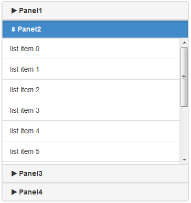
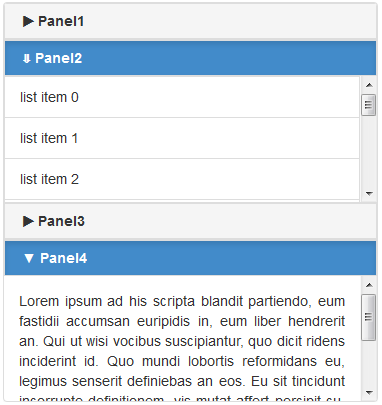

# deliteful/Accordion

``deliteful/Accordion`` is a layout container that displays a vertically stacked list of Panels whose titles are all
visible, but only one or at least one panel's content is visible at a time (depending on the `mode` property value).
Once the panels are in an accordion, they become collapsible Panels by replacing their headers by ToggleButtons.  
When a panel is open, it fills all the available space with its content.




##### Table of Contents
[Element Instantiation](#instantiation)  
[Element Configuration](#configuration)  
[Element Styling](#styling)  
[User Interactions](#interactions)  
[Element Events](#events)  
[Enterprise Use](#enterprise)  

<a name="instantiation"></a>
## Element Instantiation

See [`delite/Widget`](/delite/docs/master/Widget.md) for full details on how instantiation lifecycle works.

### Declarative Instantiation

```js
require(["deliteful/Accordion", "deliteful/Panel", "requirejs-domready/domReady!"], function () {
});
```

```html
<html>
	<d-accordion id="accordion" selectedChildId="panel1">
		<d-panel id="panel1" label="panel1">
			<div>Content - Panel1 (Default open panel)</div>
		</d-panel>
		<d-panel id="panel2" label="panel2">
			<div>Content - Panel2</div>
		</d-panel>
		<d-panel id="panel3" label="panel3">
			<div>Content - Panel3</div>
		</d-panel>
	</d-accordion>
</html>
```

### Programmatic Instantiation

```js
require([
	"deliteful/Accordion", "deliteful/Panel", "requirejs-domready/domReady!"
], function(Accordion, Panel) {
	var panel1 = new Panel({label: "panel1"});
	var panel2 = new Panel({label: "panel2"});
	var panel3 = new Panel({label: "panel3"});
	var accordion = new Accordion ({mode: "multipleOpen"});
	accordion.addChild(panel1);
    accordion.addChild(panel2);
    accordion.addChild(panel3);
    accordion.placeAt(document.body);
});
```

<a name="configuration"></a>
## Element Configuration

`deliteful/Accordion` support `delite` display infrastructure by inheriting from `delite/DisplayContainer`.
For more informations, see [`delite/DisplayContainer`](/delite/docs/master/DisplayContainer.md) documentation.

### Properties

The following properties can be set on a `deliteful/Accordion` instance:

* `mode`: The mode of the Accordion. Its value is either `singleOpen` or `multipleOpen`.
On `singleOpen` mode, only one panel is open at a time. The current open panel is closed when another panel is open.
on `multipleOpen` mode, several panels can be open at a time. Panels can be closed but there's always at least one open.

* `selectedChildId`: The id of the panel to be open at initialization. If not specified, the default open panel is the first one.
On `singleOpen` mode, this property contains the id of the current open panel.

* `animate`: If true, animation is used when a panel is opened or closed. Animations are disabled on IE.

* `openIconClass`: The default CSS class to apply to DOMNode in children headers to make them display an icon when they are
open. If a child panel has its own iconClass specified, that value is used on that panel.

* `closedIconClass`: The default CSS class to apply to DOMNode in children headers to make them display an icon when they are
closed. If a child panel has its own closedIconClass specified, that value is used on that panel.

<a name="showingPanel"></a>
### Showing a panel's content

To show the content of a child Panel of the Accordion, call the `show` method:

```js
  accordion.show(panel2);
```

The `show` method takes as argument a DOM node instance or id. The content of the respective  panel will be shown.
On `singleOpen` mode, this method will hide the content of the current open Panel.
If the panel is already open, the method doesn't has any effect.

<a name="hidingPanel"></a>
### Hiding a panel's content

Hiding the content of a panel is only possible on `multipleOpen` mode.
To hide the content of a child Panel of the Accordion, call the `hide` method:

```js
  accordion.hide(panel2);
```

The `hide` method takes as argument a DOM node instance or id. The content of the respective  panel will be hidden.
If the panel is the only one open, the method doesn't has any effect.

<a name="styling"></a>
## Element Styling

`deliteful/Accordion` does not provide any CSS class for styling, but the panels can be stylized using the `deliteful/Panel`
CSS classes and the `deliteful/ToggleButton` CSS classes.

The default height of a `deliteful/Accordion` is ``100%``. When the height of a Accordion is expressed as a percentage,
you must ensure that the height of its parent is defined, you must recursively apply the same rule, up to ``<body>`` and
 ``<html>`` elements if needed.
An HTML full-screen application has its ``<body>`` and ``<html>`` elements height set to ``100%``.
You can set height of ``<body>`` and ``<html>`` to ``100%`` by including [`defaultapp.css`](/delite/docs/master/defaultapp.md)


<a name="interactions"></a>
## User Interactions

The user interactions are given by the toggle button used in the panels header. User can activate/deactivate in order to
show/hide (respectively) the content of the panel by:

* Clicking it using a mouse,
* Tapping it on a touch screen device,
* Pressing the SPACE/Enter key when the button has keyboard focus.

When focus is on a panel's header, user can navigate between the different panels by using the following key commands:

* `up/left arrow`: move focus to the previous panel's header. If focus is on first panel's header, moves focus to last panel's header.
* `down/right arrow`: move focus to the next panel's header. If focus is on last panel's header, moves focus to first panel's header.
* `home`: move focus to the first panel's header.
* `end`: move focus to the last panel's header.
* `Enter/Space`: if panel is closed, shows the content of the panel. (see [Showing a panel's content](#showingPanel)).
   If panel is open, hides the content of the panel. (see [Hiding a panel's content](#hidingPanel))

Note: On `singleOpen` mode, clicking, tapping or pressing the SPACE/Enter key on the button of the open panel, doesn't has any effect.
Same thing on `multipleOpen` mode when there's only one open panel. In both case, in order to keep always at least one panel open.

<a name="events"></a>
## Element Events
`deliteful/Accordion` support `delite` display events by inheriting from `delite/DisplayContainer`.
For more informations, see [`delite/DisplayContainer`](/delite/docs/master/DisplayContainer.md) documentation.

Note: When `show()` method is called an additional `delite-display-load` event is fired with as `dest` property the
reference to the content to load on the specified panel.


<a name="controller"></a>
## Writing a Controller for Accordion

An application framework such as [dapp](https://github.com/ibm-js/dapp) can setup a controller to listen to events from
`deliteful/Accordion` and provide alternate/customized features.

In the following example the controller is listening to `delite-display-load` event in order to create a panel
loading the content on demand:

```js
	document.addEventListener("delite-display-load", function (evt) {
		// Verify if the panel already exists
		var panel = typeof evt.dest === "string" ? document.getElementById(evt.dest) : evt.dest
		if (!panel) {
			evt.setChild(new Promise(function (resolve, reject) {
				// load the data for the specified id, then create a panel with that data
				loadData(evt.contentId).then(function (data) {
					var child = new Panel({label: evt.dest, id: evt.dest});
					evt.setContent(child, data);
					resolve({child: child});
				});
			}));
		}
	});
```

In order to notify `delite/Accordion` that the controller is handling child loading, the controller must
call the event's `setChild()` method, passing in either a value or a promise for the value.  The value is
of the form `{child: HTMLElement}`.
The event also provides the method `setContent()` that must be used to specify the content for the panel.
It's important to note that `evt.dest` make reference to the Panel id and `evt.contentId` to the content id.

The user would have access to this through the `show()` and `hide()` methods. e.g; `show("p1", {contentId: newContent})`.
The example could be changed to load new content even if the panel already exists. See samples/Accordion-controller.


Another interesting behaviour that can be achieved by using a controller is creating empty panels and loading their content
only when the panel is opened. In the following example there's a way to achieve that:

HTML:

```html
	<d-accordion id="accordion">
		<d-panel id="p1" label="Panel1">
		</d-panel>
		<d-panel id="p2" label="Panel2">
		</d-panel>
	</d-accordion>
```

JS:

```js
	document.addEventListener("delite-display-load", function (evt) {
		// find the panel using its id
		var panel = typeof evt.dest === "string" ? document.getElementById(evt.dest) : evt.dest
		// verify if the panel is empty
		if (panel && isEmpty(panel)) {
			evt.setChild(new Promise(function (resolve, reject) {
				// load the content for the specified id, then set that data to the panel
				loadContent(evt.dest).then(function (content) {
					evt.setContent(panel, content);
					resolve({child: panel});
				});
			}));
		}
	});
```

<a name="enterprise"></a>
## Enterprise Use

### Accessibility

|type|status|comment|
|----|------|-------|
|Keyboard|ok|It is keyboard navigable (see [User Interactions](#interactions))|
|Visual Formatting|ok|Supports high contrast on Firefox and Internet Explorer desktop browsers.|
|Screen Reader|ok|Based on WAI-ARIA Pattern for Accordion: http://www.w3.org/TR/2013/WD-wai-aria-practices-20130307/#accordion. Tested with JAWS and VoiceOver|

### Globalization

`deliteful/Accordion` does not provide any internationalizable bundle.

### Security

This widget has no specific security concern. Refer to [`delite/Widget`](/delite/docs/master/Widget.md) for general security advice on this base class.

### Browser Support

This widget supports all supported browsers. On Internet Explorer, animations are disabled.

