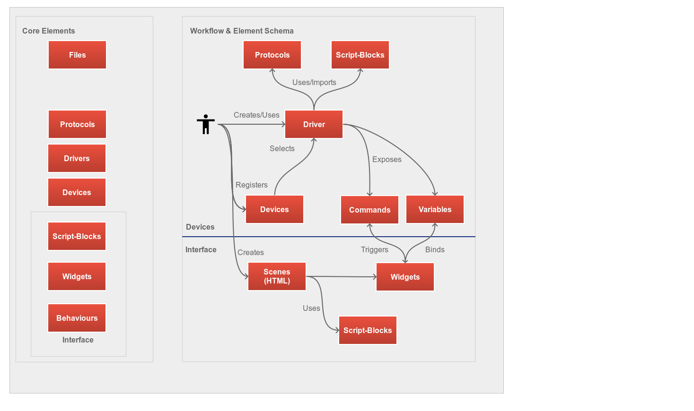
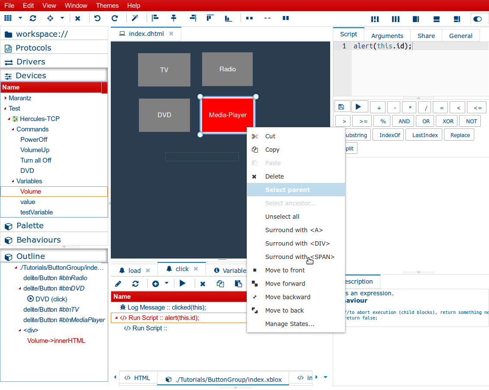

### Index

[1. Overview workflow & key elements](#Overview) 
[2. Overview key elements and their interfaces](#Interfaces) 
[2.1. Files](#Files) 
[2.2. Drivers](#Drivers) 
[2.3. Widgets](#Widgets) 

	 
	 

### <a name="Overview">1. Overview Workflow & Key Elements</a>

The illustration below shows the key ingredients being used when authoring a "ControlFreak" application:

The workflow explained in short:

 1. Author creates or uses "Drivers". "Drivers" are essentially the outlets for devices and expose functionality as "Commands" and if there is any data about the device, a driver exposes this as "Variables". For instance a command might be "Volume Up" and variable can be "Current Volume".
 2. As soon a driver is complete, the user typically wants to create an interface for this device. To archive this, the user registers a device by using its network information, ie: its IP address. After a device is registered, the user must associate this to a driver. 
 3. From here on its really easy, the user now drag's the exposed commands onto widgets. The IDE does here already lots of things for the user. For instance, when dragging a command like "Power Off" onto a button, the IDE will bind this command to the "on click" event for the button. When dragging a variable like "Current Volume" onto a slider, the IDE will bind this variable to the widget's "on change" event. The IDE also sets up a bi-directional connection between the slider and this variable. 
 4. Finally, the user exports the scene for sharing or as mobile-application. That it.

### <a name="Interfaces">Overview key elements and their interfaces</a>

Please find below a short description for each key element of the IDE. 

#### <a name="Files">2.1 Files</a>

All is based on files! In fact you don't need even the Control-Freak IDE, you can open all files with your preferred editor. The IDE will recognize file changes  and updates all accordingly. 

The file manager (["xamiro"](http://mc007.github.io/xamiro-docs/Getting_Started.html)) is the most important interface of the IDE and it comes with powerful plugins and leaves almost no wishes open.  

**Remarks**

 - Most key elements come with their own editors and interfaces but as "ControlFreak" uses only open standards and formats, you can always edit an item in its raw form. The file panel in the IDE allows you to quickly navigate to different locations such as drivers, themes, HTML files.    

 - The file manager comes with a powerful text editor (ACE) and provides: 
	 - auto-completion (across all open files and items)
	 - beautifiers to adjust intends 
	 - split views
	 - a visual diff
 - The file manager also provides:
	 - picture editor
	 - drag'n drop upload into any panel
	 - visual markdown editor
	 - a batch language to have folder and file actions
	 - a bash shell
	 - an advanced logging

#### <a name="Drivers">2.2 Drivers</a>

The next important key element of the IDE are 'drivers'. Drivers are essentially the gate to devices and their purpose is to expose device functions for a higher audience (designers). 

Lets take a look:

Like any other item in the IDE, you can create, manage and duplicate drivers as you like. ControlFreaks provides a visual block language called "XBlox". Commands or variables are basically a specialized blocks. Each block has its own properties which you can edit easily.

The driver editor explained in short:

- "**Commands**": are special blocks which can have child blocks. For instance you can turn off a device and send an email right afterwards by simply creating a new command, and then attach more blocks to it like  the "Log" block.

- "**Responses**" are collection blocks being executed each time a device sends anything.

- "**Variables**" are collection of variables. Variables can be used in expressions (ie: as part of a command). For instance a variable "Volume" migh hold the value "100". In order to have a simple command called "VolumeUp", all you need to write in the command's send field is: [Volume]+10.

#### <a name="Widgets">2.3 Widgets & interface designer</a>

The interface designer brings all together, widgets & devices:

All you need to do is dragging "Commands" or "Variables' on widgets and follow the wizards.

You can use from a HTML & widget palette:

You can attach block scripts to any widget or its events:

(The picture above shows the "Set Style Block" which can operate in many ways and can style multiple elements in just one block)

**Remarks**

- The visual editor is in sync with its source HTML editor

- You can attach 'xblox' scripts per event on widget or global level. You can choose from standard events like 'onlick' but also system events (100+) like "device did shutdown'. 

- Each scene is being generated from a template located in the workspace folder. It comes with 3 files: index.css, index.less, index.xblox. 

- When editing a scene's LESS file, the IDE automatically compiles this to css on the fly. 

- The adds IDE includes some minimum comfort to each scene by default:
	- jQuery
	- Velocity
	- Lodash/Underscore
	- Require-JS
	- IBM-JS
	- A standard collection of LESS macros

